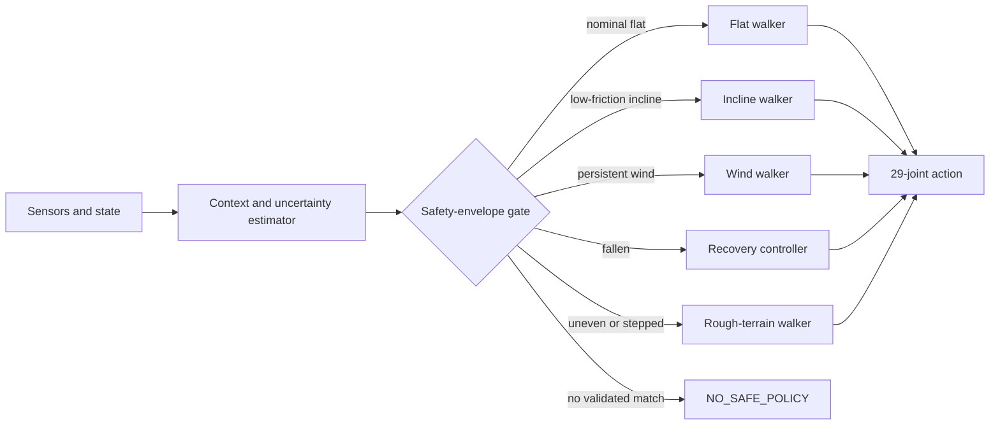

# Humanoid Climber

Repository-owned MjLab tasks and policy-routing research for a Unitree G1 that
can walk, climb low-friction slopes, resist wind, recover from a fall, and
eventually cross rough terrain. MjLab remains an external Python dependency;
its source is not copied into this repository.

## Setup

```bash
uv venv --python 3.12 .venv-rl
UV_PROJECT_ENVIRONMENT=.venv-rl uv sync
```

Downloaded checkpoints belong in `ckpt/` and are ignored by Git.

## System goal: a safety-aware library of validated baselines

No single controller is expected to handle every mountain condition. The
target system is a **hard-gated library of baseline policies**. The stock flat
walker is the first baseline. If measured conditions remain inside its verified
tolerance, the supervisor uses it. Conditions outside that envelope are trained
in a separate environment; after the resulting policy passes controlled
evaluation, it is added as another baseline with its own verified envelope. A
supervisor estimates the environment and robot state, scores every baseline
against its envelope, switches with hysteresis, and reports `NO_SAFE_POLICY`
when no controller is suitable.

The first version will switch complete policies rather than blend their actions.
This is easier to validate and avoids producing an untested action between two
otherwise safe controllers. Every specialist controls the same 29 G1 joints,
but each policy keeps its own observation normalizer and network because the
recovery and locomotion observation spaces are different.

### Policy portfolio

| # | Specialist | State | Training environment | Current evidence |
|---:|---|---|---|---|
| 1 | Flat-ground walker | **Available** | Flat ground, friction `0.3–1.2`, no modeled wind | Stock public MjLab G1 checkpoint; local playback works |
| 2 | Low-friction incline walker | **Available, intermediate** | Gradient `0.0–0.2`; friction `0.1–1.0`; no modeled wind | `model_34400.pt`; improved the matched gradient-`0.2`, friction-`0.15` benchmark but is not yet reliable |
| 3 | Flat-ground wind walker | **Training disabled** | Flat ground; friction `0.15–1.0`; wind X `-4–4 N`, Y `-16–16 N` | The decision log may show `FINE TUNING NEW POLICY`; no trainer is active |
| 4 | Supine recovery controller | **Training disabled** | Eight-second supine-to-standing motion; friction `0.3–1.2`; randomized reference state | The decision log may show `FINE TUNING NEW POLICY`; no trainer is active |
| 5 | Rough-terrain walker | **Planned** | Initial target: friction `0.2–1.0`, gradient `0.0–0.2`, terrain relief `0–0.10 m`, steps `0–0.15 m` | Task, checkpoint, and validated envelope do not exist yet |

These ranges describe training domains or proposed targets, **not automatic
safety guarantees**. A range enters the supervisor's operating envelope only
after deterministic evaluation establishes acceptable fall rate, tracking
error, and recovery success at that condition.

### Supervisor inputs and routing

The context estimator will consume quantities available in simulation and later
replace them with onboard estimates:

- torso orientation, height, angular velocity, and fall state;
- terrain gradient and roughness or step height;
- foot slip and estimated contact friction;
- wind or persistent external-force estimate;
- command velocity and each policy's recent tracking error;
- uncertainty and out-of-distribution score for every estimate.

Routing priority is deliberately safety-first:

1. If the robot is fallen and recovery confidence is high, select recovery.
2. Otherwise prefer rough terrain, wind, incline, then flat specialists when
  their validated envelopes match.
3. In overlapping envelopes, select the policy with the largest calibrated
  safety margin rather than the largest raw neural-network confidence.
4. Require several consecutive observations before switching and enforce a
  cooldown to prevent policy oscillation at envelope boundaries.
5. If every score is below threshold, emit `NO_SAFE_POLICY`, stop advancing,
  enter a stable hold/crouch behavior when feasible, and request intervention.



The supervisor itself must be evaluated. Required tests include boundary
sweeps, noisy context estimates, delayed estimates, rapid condition changes,
failed recovery attempts, and conditions outside every policy envelope.

### Required MuJoCo overlay

The future mixture-of-policies wrapper must render its decisions directly over
the MuJoCo/Viser simulation, not only write them to logs. The overlay should
show enough information to explain every switch:

- active policy and previous policy;
- switch reason, confidence, safety margin, and cooldown state;
- slope, terrain roughness, estimated friction/slip, and wind vector;
- torso height/orientation, fall detector, and recovery state;
- commanded and measured velocity;
- each candidate policy's envelope result (`eligible`, `rejected`, or
  `uncertain`);
- a prominent `NO_SAFE_POLICY` warning and requested safe action;
- scenario mode, scenario phase, simulation time, and random seed.

The overlay is part of the system interface: screenshots and videos should be
enough to audit what the router believed, why it selected a policy, and whether
the actual robot response matched that decision.

### Live policy and event log

`hum-climber-play --viewer viser` installs a repository-owned **Policy
Supervisor** panel with a dedicated **Decision Log** tab. The pre-action routing
pass reads the actual MuJoCo terrain geometry, randomized foot friction, applied
torso wrench, and torso pose. That same pass selects the callable which produces
the next 29-joint action, so the log's `ACTUALLY EXECUTING` line cannot silently
diverge from the controller driving the robot.

The current router has exactly four user-facing policy classes: regular flat
walking, low-friction incline walking, wind walking, and fall recovery. Rough,
stepped, combined, or out-of-envelope conditions are logged as unknown and use
the closest **loaded** policy as an explicit fallback. The local checkout
currently contains only `g1_velocity_model_final.pt`, so the live demo truthfully
labels incline, wind, and recovery requests as flat-walker fallbacks until their
compatible checkpoints are present.

Unknown or unavailable-policy events emit a `FINE TUNING NEW POLICY` entry in
the decision log, including the sensed context and requested policy. This is a
signal only: there is no fine-tuning queue, callback, subprocess, network upload,
or weight mutation. `hum-climber-train` is hard-disabled until the project
explicitly implements and enables that path.

### Scenario generation

The policy supervisor will be tested with two complementary kinds of continuous
simulation:

1. **Scripted scenarios:** slope, friction, wind, and roughness change according
  to a known timeline. These runs are deterministic, repeatable, and suitable
  for regression tests and synchronized comparison videos. Example phases are
  flat/no-wind, increasing slope, low-friction incline, crosswind, forced fall,
  recovery, and resumed locomotion.
2. **Random scenarios:** the same variables can change at random times and to
  random values within configured bounds. A seeded random generator must record
  every sampled transition so a failure can be replayed exactly. Out-of-range
  samples are intentionally allowed in robustness tests to verify that the
  supervisor emits `NO_SAFE_POLICY` rather than silently selecting a controller.

Training randomization and evaluation randomization must remain separate.
Scripted runs establish comparable benchmarks; seeded random runs discover
unexpected interactions and policy-boundary failures.

## Controlled and randomized treadmill environments

The first controlled/randomized scenario pair is implemented as two separate tasks:

- `HumClimber-Velocity-Controlled-Unitree-G1` is the admission benchmark. It
  uses seed `42`, flat terrain, friction `0.6`, no wind or pushes, the nominal
  robot model, a clean initial state, and a fixed `0.5 m/s` forward command.
- `HumClimber-Velocity-Randomized-Unitree-G1` is one visible `200 × 5 m` flat
  treadmill strip. The command remains `0.5 m/s` forward while wind, ice, and
  slope occur one at a time for `3–8 s`, with a neutral `2–5 s` break after
  every event.
  Spawn state, joint state, encoder bias, torso inertia/COM, joint dynamics, PD
  gains, and action latency are also sampled within bounded ranges.

The randomized task deliberately has no slope grid, obstacle field, roughness
patches, or stairs. The robot keeps walking forward on the single flat strip as the
surrounding conditions change in time, which acts like successive treadmill
windows without teleporting the robot between terrain tiles. Dynamic ranges are:

| Condition | Randomized range |
|---|---|
| Foot friction | Normal `0.65–1.0`; ice event `0.05–0.18` |
| Slope gradient | `-0.20–0.20` (downhill to uphill), changed every `3–8 s` |
| Wind force | X `-8–8 N`, Y `-20–20 N`, Z `-3–3 N` |
| Velocity command | Fixed X `+0.5 m/s`; Y and yaw `0` |
| Event window | One of wind, ice, or slope for `3–8 s` |
| Neutral break | Flat, no wind, normal grip for `2–5 s` between events |
| Root pose and velocity | Random XYZ/RPY offsets and initial velocity |
| Joint state | Position `±0.08 rad`, velocity `±0.15 rad/s` |
| Encoder bias | `±0.02 rad` |
| Torso density/COM | Log density scale `±0.08`, COM `±0.02 m` |
| Joint dynamics | Damping/friction `0.8–1.2×`, armature `0.9–1.1×` |
| PD gains | Stiffness and damping `0.85–1.15×` |
| Action latency | `0–2` physics steps |

Both tasks preserve the stock walker's 99-observation actor and 29-action
interface. For now they are playback and decision-signal environments only.
Training execution is intentionally disabled.

The ice phase is rendered as a translucent blue treadmill surface. The slope
phase keeps the same physical gradient range and adds a blue-to-red color ramp
around the robot to make uphill/downhill direction visible; the color ramp does
not make the slope steeper or add collision geometry.

### Sensor-only imbalance recovery

The live Viser supervisor detects a developing fall using only the G1's IMU
up-vector, IMU roll/pitch angular velocity, and two foot-contact readings. It
does not read the robot's position, treadmill dimensions, edge distance,
commanded velocity, slope state, or any other environment parameter. A short
six-sample persistence check rejects the transient tilt and contact changes of
a normal walking stride. A persistent dynamic tip, severe body tilt, or tilted
and rotating loss of both foot contacts bypasses the walking checkpoint, zeros
the locomotion command and planar velocity, and holds a deterministic 29-joint
crouched sit for two seconds. Vertical velocity remains under physics control so
the body can settle onto the treadmill instead of being suspended mid-crouch.
Because no trained stand-up policy exists yet, the environment then resets and
resumes walking rather than remaining permanently latched. Its
concise decision-log entry is:

`Detected imbalance, executing sit-down recovery policy.`

Play the controlled benchmark:

```bash
UV_PROJECT_ENVIRONMENT=.venv-rl uv run hum-climber-play \
  HumClimber-Velocity-Controlled-Unitree-G1 \
  --checkpoint-file ./ckpt/g1_velocity_model_final.pt \
  --num-envs 1 \
  --viewer viser
```

Run the randomized treadmill with the same checkpoint:

```bash
UV_PROJECT_ENVIRONMENT=.venv-rl uv run hum-climber-play \
  HumClimber-Velocity-Randomized-Unitree-G1 \
  --checkpoint-file ./ckpt/g1_velocity_model_final.pt \
  --num-envs 1 \
  --viewer viser
```

When the router sees a condition outside the loaded baseline's envelope, the
Decision Log records `FINE TUNING NEW POLICY` and continues with the explicitly
displayed loaded fallback. It does not launch the existing Hugging Face wrappers
or the MjLab trainer. Running `hum-climber-train` exits immediately with a
training-disabled message.

### Persistent simulation after a fall

The combined simulation must **not close or immediately reset when locomotion
reports a fall**. A fall becomes a supervisor event rather than a terminal
application event:

1. Freeze or replace the locomotion command and classify the fallen pose.
2. Keep MuJoCo, the viewer, telemetry, and scenario clock alive.
3. Switch to a compatible recovery policy when one is validated.
4. After uprightness is stable for a dwell period, return to an eligible
  locomotion policy with action interpolation or another tested handoff.
5. If recovery is unavailable, unsafe, or repeatedly fails, emit
  `NO_SAFE_POLICY` and hold the simulation open for inspection/intervention.

Individual PPO training environments may still terminate and reset episodes;
that behavior is useful for learning. The no-close requirement applies to the
top-level demonstration/evaluation wrapper, which must own episode lifecycle
instead of allowing a specialist policy's fall termination to exit the app.

## Evaluate the stock walker on ice

```bash
UV_PROJECT_ENVIRONMENT=.venv-rl uv run hum-climber-play \
  HumClimber-Velocity-Ice-Unitree-G1 \
  --checkpoint-file ./ckpt/g1_velocity_model_final.pt \
  --num-envs 1 \
  --viewer viser
```

The task uses the stock G1 velocity observation and action interfaces, allowing
the unchanged flat-ground checkpoint to load. Training friction is randomized
from 0.1 to 1.0. Evaluation uses friction 0.1 on a fixed uphill slope with a 0.2
gradient (approximately 11.3 degrees). The 16-by-16-meter terrain provides four
times the surface area of the earlier test. Playback uses the stock randomized
velocity commands, including forward, lateral, and turning movement.

## Simulate crosswind

The separate wind task preserves the original no-wind benchmark while applying
a physical world-frame force to the G1 torso. Evaluation uses a deterministic
`16 N` lateral crosswind. The dedicated flat-wind policy currently in training
samples an episode-long lateral force from `-16 N` to `+16 N`, a
headwind/tailwind component from `-4 N` to `+4 N`, and friction from `0.15` to
`1.0`:

```bash
UV_PROJECT_ENVIRONMENT=.venv-rl uv run hum-climber-play \
  HumClimber-Velocity-Ice-Wind-Unitree-G1 \
  --checkpoint-file ./ckpt/recovered/model_34400.pt \
  --num-envs 1 \
  --viewer viser
```

The wind changes only the simulated external wrench; observations and actions
remain checkpoint-compatible with the stock and fine-tuned G1 policies. The
existing checkpoint was not trained with wind, so this mode measures robustness
rather than wind-trained performance. Viser displays the applied wind above the
robot as a cyan direction arrow and a label such as `WIND +Y | 16 N`.
The direction and magnitude appear in bold black directly above the arrow.

To isolate wind from the slope, run the stock checkpoint on flat terrain with
fixed friction `0.15` and the same `16 N` crosswind:

```bash
UV_PROJECT_ENVIRONMENT=.venv-rl uv run hum-climber-play \
  HumClimber-Velocity-Flat-Wind-Unitree-G1 \
  --checkpoint-file ./ckpt/g1_velocity_model_final.pt \
  --num-envs 1 \
  --viewer viser
```

The stock checkpoint in this command is a baseline, not the wind-trained
checkpoint. The latter will be evaluated and added only after the active
fine-tuning Job produces a candidate model.

## Fine-tune on ice

> Historical runbook only. Training is currently hard-disabled by
> `hum-climber-train`; the commands in this section are retained for provenance
> and will exit without launching a trainer.

Fine-tuning starts from the existing flat-walking checkpoint. Training uses a
terrain curriculum from flat ground through a 0.2 gradient while randomizing
foot friction from 0.1 to 1.0. The actor and critic interfaces remain identical
to the stock G1 task.

Place the pretrained checkpoint where MjLab's resume loader can find it:

```bash
mkdir -p logs/rsl_rl/g1_ice/pretrained
cp ckpt/g1_velocity_model_final.pt logs/rsl_rl/g1_ice/pretrained/model_0.pt
```

Then launch fine-tuning on a Linux NVIDIA GPU:

```bash
UV_PROJECT_ENVIRONMENT=.venv-rl uv run hum-climber-train \
  HumClimber-Velocity-Ice-Unitree-G1 \
  --env.scene.num-envs 4096 \
  --agent.resume True \
  --agent.load-run pretrained \
  --agent.load-checkpoint model_0.pt \
  --agent.max-iterations 5000 \
  --agent.run-name slope-0.2-friction-0.1 \
  --agent.logger tensorboard \
  --agent.upload-model False
```

Training outputs are written under `logs/rsl_rl/g1_ice/`. Checkpoint resume and
one PPO iteration were smoke-tested locally on August 29, 2026. Full training
should run on Hugging Face Jobs rather than macOS because MjLab training is
intended for Linux with NVIDIA acceleration.

The Hugging Face job entry point is `scripts/hf_train.sh`. Its `NUM_ENVS`,
`MAX_ITERATIONS`, `RUN_NAME`, and `HF_OUTPUT_REPO` environment variables allow
the same immutable project snapshot to run a short smoke test or the full job.

## Train the recovery specialist

The recovery task uses MjLab's native G1 model, all 29 controlled joints, a
50 Hz controller, and an eight-second supine-to-standing reference. The public
HumanUP joint trajectory is used only as motion guidance; HumanUP weights and
its Isaac Gym runtime are not used by the final policy. Six wrist joints absent
from that reference are mapped to neutral targets.

The recovery network cannot reuse walking weights because its actor has 160
tracking observations rather than the walker's 99 velocity observations. It is
therefore trained from scratch with a separate normalizer and checkpoint. A
local CPU smoke run completed one PPO iteration before the bounded cloud Job
was launched. The private motion artifact and checkpoints remain outside Git.

## Reproduction and operations runbook

This section records how the current results and active training runs were
produced. It intentionally contains no Hugging Face access token. Authenticate
interactively or inject `HF_TOKEN` through the Jobs secret mechanism; never put
its value in a command, script, commit, log, or README.

### Local environment and tests

```bash
uv venv --python 3.12 .venv-rl
UV_PROJECT_ENVIRONMENT=.venv-rl uv sync
UV_PROJECT_ENVIRONMENT=.venv-rl uv run pytest -q
```

The validated suite currently contains 53 tests. Training uses
Linux/NVIDIA; macOS is used for editing, CPU smoke tests, evaluation, and Viser
playback.

### Checkpoints used so far

- Stock velocity policy: `ckpt/g1_velocity_model_final.pt`, downloaded from the
  public `robomotic/mjlab-policies` G1 velocity release.
- Recovered incline policy: `ckpt/recovered/model_34400.pt`, produced by
  fine-tuning the stock policy and kept outside Git.
- Wind and recovery candidates: uploaded periodically by the active Jobs to a
  private personal model repository and not committed to this repository.

Play the stock policy in its original flat environment:

```bash
UV_PROJECT_ENVIRONMENT=.venv-rl uv run hum-climber-play \
  Mjlab-Velocity-Flat-Unitree-G1 \
  --checkpoint-file ./ckpt/g1_velocity_model_final.pt \
  --num-envs 1 \
  --viewer viser
```

The ice, incline-wind, and flat-wind playback commands are documented in the
sections above.

### Local recovery smoke test

The private safe NPZ motion was generated from an already audited, converted
HumanUP source NPZ:

```bash
UV_PROJECT_ENVIRONMENT=.venv-rl uv run python \
  scripts/build_recovery_motion.py \
  private_assets/recovery/humanup_getup_source.npz \
  private_assets/recovery/g1_humanup_getup_50hz.npz
```

The native task was then tested with two CPU environments and one PPO update:

```bash
UV_PROJECT_ENVIRONMENT=.venv-rl uv run hum-climber-train \
  HumClimber-Tracking-Recovery-Unitree-G1 \
  --gpu-ids None \
  --log-root /tmp/hc-recovery-smoke \
  --env.scene.num-envs 2 \
  --agent.max-iterations 1 \
  --agent.num-steps-per-env 4 \
  --agent.save-interval 1 \
  --agent.run-name smoke \
  --agent.logger tensorboard \
  --agent.upload-model False
```

### Privacy-minimized cloud training

The cloud workflow used for wind and recovery is:

1. Package only required project files and ignored private motion/checkpoint
   inputs into a temporary archive.
2. Inspect the archive contents before upload.
3. Upload it to a verified-private repository in the personal namespace.
4. Launch under the organization billing namespace with no mounted volume.
5. Pass only the secret name `HF_TOKEN`; the secret value is never shown.
6. Download and extract the private archive inside the ephemeral Job container.
7. Run `scripts/hf_train_wind.sh` or `scripts/hf_train_recovery.sh`.
8. Upload checkpoints every ten minutes and on normal or termination handling.
9. Remove the temporary local archive and track only sanitized Job metadata.

The launch shape is shown below with private identifiers represented by
placeholders:

```bash
UV_PROJECT_ENVIRONMENT=.venv-rl uv run --with huggingface_hub hf jobs run \
  --detach \
  --namespace <billing-organization> \
  --name hc-train-YYYYMMDD-HHMM \
  --flavor a10g-small \
  --timeout 8h \
  --secrets HF_TOKEN \
  -- ghcr.io/astral-sh/uv:python3.12-bookworm-slim \
  sh -lc 'download-and-extract-private-source; exec sh <training-wrapper>'
```

No `--volume` argument is used. Organization administrators can still audit
Job metadata, billing, command, and potentially logs; this workflow minimizes
source/checkpoint exposure but does not make organization Jobs anonymous.

The wind run uses 1,024 environments, starts from the stock velocity checkpoint,
and calls `scripts/hf_train_wind.sh`. The recovery run uses 1,024 environments,
starts its tracking network from scratch, and calls
`scripts/hf_train_recovery.sh`. Both use A10G hardware, an eight-hour hard
timeout, private periodic checkpoint uploads, and project-local sanitized
tracking under the ignored `logs/` directory.

## Planned rough-terrain specialist

The fifth policy will start from the strongest compatible locomotion checkpoint
and train on a curriculum of height-field noise, small steps, uneven friction,
and slopes. Wind should initially remain disabled so rough-terrain capability
can be measured independently; combined roughness and wind comes only after
both specialists have reliable individual benchmarks.

The initial proposed curriculum is:

1. Flat height noise from `0` to `0.05 m`.
2. Terrain relief up to `0.10 m`.
3. Steps from `0` to `0.15 m`.
4. Gradient from `0.0` to `0.2`.
5. Friction randomization from `0.2` to `1.0`.

These are design targets and will remain marked `Planned` until the task is
implemented, trained, and evaluated.

On the training Mac, `scripts/poll_hf_job.sh` is installed as the launchd agent
`com.humclimber.hf-job-poll`. It checks the active job every 20 minutes, writes
status updates to `logs/job-monitor/hf-job.log`, and shows a macOS notification
when the job completes or stops with an error.

## Evaluate a checkpoint headlessly

The deterministic evaluator runs matched parallel episodes without opening a
viewer and writes per-episode JSON under the ignored `logs/` directory:

```bash
UV_PROJECT_ENVIRONMENT=.venv-rl uv run python scripts/evaluate_policy.py \
  ckpt/recovered/model_34400.pt \
  --episodes 16 \
  --steps 500 \
  --forward-speed 0.5 \
  --friction 0.15 \
  --seed 42 \
  --output logs/evaluation/model_34400_friction_0.15.json
```

## Results

The stock policy and recovered `model_34400.pt` checkpoint were tested with
matched seeds on the fixed `0.2`-gradient slope. Each condition used 16
episodes, a constant `0.5 m/s` forward command, and a 10-second limit.

| Friction | Policy | Fall rate | Mean survival | Max. height gain | Mean reward |
|---:|---|---:|---:|---:|---:|
| 0.10 | Stock | 93.75% | 4.31 s | 0.03 m | -0.98 |
| 0.10 | Fine-tuned | 100% | 5.63 s | 0.07 m | 16.20 |
| 0.15 | Stock | 75% | 5.28 s | 0.03 m | -4.42 |
| 0.15 | Fine-tuned | **68.75%** | **7.70 s** | **0.14 m** | **23.22** |

At friction `0.15`, fine-tuning increased mean survival by `2.42 s`; the paired
95% confidence interval was `+0.81` to `+4.03 s`. Balance, height, and reward
also improved, but the policy still fell in most episodes. It is a stronger
intermediate policy, not yet a reliable climber. See [evaluation.md](evaluation.md)
for the complete metrics and confidence intervals.

## Development log

### August 29, 2026 — environment and baseline

- Created an isolated Python 3.12 environment with `uv`, MjLab 1.6.0, MuJoCo,
  Torch, and Warp.
- Loaded and played the stock Unitree G1 velocity checkpoint without changing
  its 99-observation/29-action policy interface.
- Implemented the project-owned ice task with friction randomized from `0.1`
  to `1.0` during training and fixed at `0.1` during evaluation.
- Added a deterministic `16 × 16 m`, `0.2`-gradient evaluation slope and a
  training curriculum from flat ground to gradient `0.2`.
- Added configuration tests for interface compatibility, friction, commands,
  slope generation, curriculum behavior, and PPO configuration.

### August 29, 2026 — training and stabilization

- Verified checkpoint resume with one local CPU PPO iteration.
- Completed a 10-iteration A10G cloud smoke test.
- Diagnosed a simulation NaN in the initial 4,096-environment run and removed
  out-of-scope random robot pushes from the low-friction task.
- Reduced the stable cloud configuration to 1,024 environments and completed a
  200-iteration stability run.
- Continued fine-tuning from iteration 30,000 through iteration 34,400 on an
  A10G before stopping the Job for organization-storage privacy cleanup.
- Recovered `model_34400.pt` locally and backed it up to a private personal
  Hugging Face model repository.

### August 29, 2026 — evaluation and privacy

- Built `scripts/evaluate_policy.py` for reproducible headless evaluation with
  fixed commands, seeds, friction, and slope conditions.
- Compared the stock and fine-tuned policies at friction `0.1` and `0.15`.
- Confirmed statistically supported improvements in survival, balance, height,
  and reward at friction `0.15`, while documenting the remaining fall rate.
- Removed Hum Climber source snapshots and training outputs from shared
  organization storage after securing the checkpoint.
- Added a privacy-first Hugging Face Jobs workflow that rejects plaintext
  secrets, local-directory uploads to organization buckets, and unverified
  checkpoint destinations.

### August 29, 2026 — wind and recovery specialists

- Added physical world-frame torso wind with Viser direction, magnitude,
  commanded-velocity, and measured-velocity overlays.
- Added a flat-wind task covering friction `0.15–1.0`, longitudinal force
  `-4–4 N`, and lateral force `-16–16 N`.
- Launched privacy-minimized flat-wind fine-tuning from the stock walking
  checkpoint; periodic checkpoints go to a private personal model repository.
- Converted the public 23-joint HumanUP get-up trajectory into a safe native
  MjLab 29-joint, 401-frame motion reference while keeping wrist targets neutral.
- Added and locally smoke-tested a native MjLab recovery tracking task, then
  launched bounded A10G training from scratch with no mounted Job volumes.
- Defined the five-policy portfolio and the planned `NO_SAFE_POLICY` supervisor
  behavior for unsupported conditions.

### August 29, 2026 — controlled/randomized environment pair

- Added a deterministic controlled benchmark and a fully domain-randomized
  training task while preserving the stock 99-observation/29-action interface.
- Randomized terrain, contact, weather, disturbance, command, initial state,
  sensor, inertial, joint, actuator, and latency parameters within documented
  physical bounds.
- Completed a two-environment CPU smoke test through one PPO update for the
  randomized task.

## Current status

- Latest recovered checkpoint: `model_34400.pt` (kept outside Git).
- Best measured condition: friction `0.15`, gradient `0.2`, with 31.25% of
  episodes completing the 10-second benchmark.
- No training job or automatic training path is active. The CLI rejects training
  attempts and the router only emits fine-tuning templates in the decision log.
- Controlled and randomized-treadmill playback environments are available; no
  randomized generalist checkpoint has been promoted.
- Next work: exercise and refine the continuous treadmill scenario and implement
  the baseline registry/context estimator/safety gate. Training remains deferred
  until explicitly enabled later. See [ideas.md](ideas.md).

## Tests

```bash
UV_PROJECT_ENVIRONMENT=.venv-rl uv run pytest -q
```
