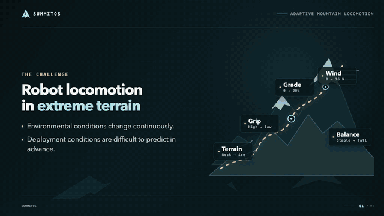
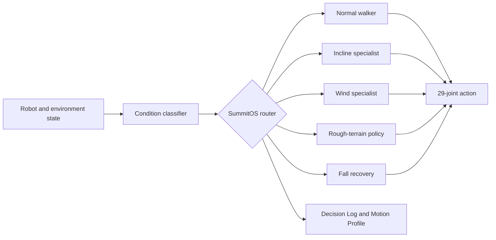

# SummitOS — Humanoid Climber

SummitOS is a runtime orchestration layer for autonomous Unitree G1 locomotion
across changing terrain and weather conditions. It classifies the active
condition and routes observations to specialist reinforcement-learning policies
for normal walking, low-friction inclines, crosswind, rough terrain, and learned
fall recovery.

## Two-minute presentation and demo



The original H.264 recording is included as
[SummitOS-presentation-and-demo.mp4](./SummitOS-presentation-and-demo.mp4).

## Highlights

- Deterministic 12-second showcase stages for reproducible demonstrations.
- Specialist checkpoint routing without blending unvalidated policy actions.
- Randomized incline angle, surface friction, and lateral wind force.
- Broad procedural rough terrain with visual-only alpine scenery.
- Fall detection and a dedicated 160-observation learned recovery controller.
- Live Viser Decision Log and Motion Profile telemetry.
- Extensible policy bank for registering and deploying new specialists without
  changing the core orchestration loop.

## Runtime architecture



All locomotion actors consume 99 observations and produce actions for the same
29 G1 joints. The recovery actor uses its own 160-observation tracking interface,
normalizer, checkpoint, and motion reference.

## Showcase sequence

| Stage | Runtime condition | Controller |
|---|---|---|
| Normal | Flat terrain at a fixed `1.0 m/s` command | Normal-terrain walker |
| Incline | `10–30°` incline with friction `0.1–0.3` | Low-friction incline walker |
| Wind | Lateral crosswind of `8–20 N` | High-wind walker |
| Rough | Randomized mounds and rocks | Rough-terrain policy |
| Recovery | Triggered after a detected fall | Learned getting-up policy |

The rough-terrain entry currently uses an explicit flat-policy checkpoint alias.
The interface is already separated so a dedicated rough checkpoint can replace
it without changing the router.

## Setup

Requirements:

- macOS or Linux
- Python 3.12
- [`uv`](https://docs.astral.sh/uv/)

```bash
uv venv --python 3.12 .venv-rl
UV_PROJECT_ENVIRONMENT=.venv-rl uv sync
```

## Run locally

The trained policy checkpoints and recovery motion are distributed privately
and are not stored in this public repository. Before launching, place the
provided artifact bundle at the repository root so it restores the expected
`ckpt/` and `private_assets/recovery/` paths.

```bash
UV_PROJECT_ENVIRONMENT=.venv-rl uv run hum-climber-play \
  HumClimber-Velocity-Randomized-Unitree-G1 \
  --checkpoint-file ./ckpt/g1_velocity_model_final.pt \
  --num-envs 1 \
  --viewer viser
```

Wait for the viewer to report its HTTP address, then open
[http://localhost:8080](http://localhost:8080). Keep the terminal process
running while using the browser.

## Repository layout

- `src/humanoid_climber/` — orchestration, routing, task configuration, safety,
  recovery adaptation, and viewer integration.
- `assets/presentation/` — recorded specialist-policy clips.
- `tests/` — routing, safety, recovery, and compiled-scene validation.
- `presentation.html` — browser-based SummitOS presentation.

At runtime, privately distributed artifacts populate `ckpt/` with locomotion
and recovery checkpoints and `private_assets/recovery/` with the recovery
motion reference.

## Validation

```bash
UV_PROJECT_ENVIRONMENT=.venv-rl uv run pytest -q
```

The current suite validates task configuration, policy envelopes, specialist
routing, environmental stages, recovery canonicalization, safety behavior, and
the compiled MuJoCo scene.
