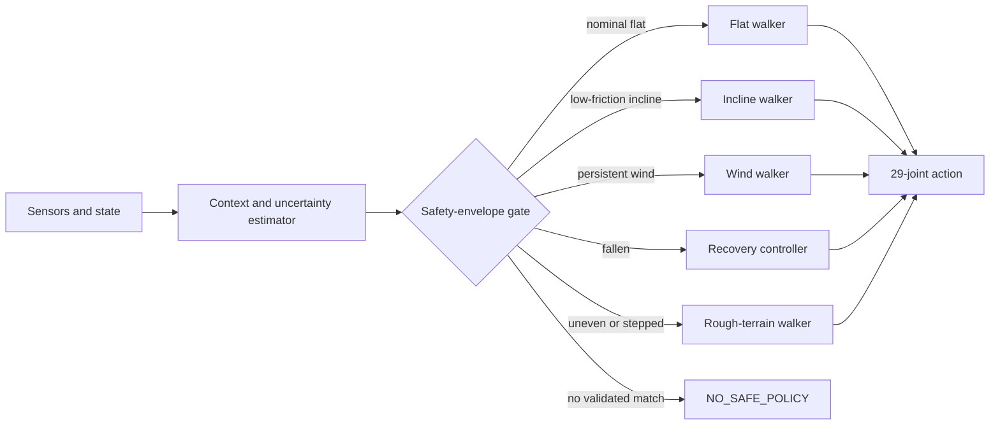

# Humanoid Climber

Repository-owned MjLab tasks and policy-routing research for a Unitree G1 that
can walk, climb low-friction slopes, resist wind, recover from a fall, and
eventually cross rough terrain. MjLab remains an external Python dependency;
its source is not copied into this repository.

## Setup

```bash
uv venv --python 3.12 .venv-rl
UV_PROJECT_ENVIRONMENT=.venv-rl uv sync
```

Downloaded checkpoints belong in `ckpt/` and are ignored by Git.

## System goal: a safety-aware mixture of policies

No single controller is expected to handle every mountain condition. The
target system is a **hard-gated mixture of specialist policies**. A supervisor
estimates the environment and robot state, scores every policy against its
verified operating envelope, switches with hysteresis, and reports
`NO_SAFE_POLICY` when no controller is suitable.

The first version will switch complete policies rather than blend their actions.
This is easier to validate and avoids producing an untested action between two
otherwise safe controllers. Every specialist controls the same 29 G1 joints,
but each policy keeps its own observation normalizer and network because the
recovery and locomotion observation spaces are different.

### Policy portfolio

| # | Specialist | State | Training environment | Current evidence |
|---:|---|---|---|---|
| 1 | Flat-ground walker | **Available** | Flat ground, friction `0.3–1.2`, no modeled wind | Stock public MjLab G1 checkpoint; local playback works |
| 2 | Low-friction incline walker | **Available, intermediate** | Gradient `0.0–0.2`; friction `0.1–1.0`; no modeled wind | `model_34400.pt`; improved the matched gradient-`0.2`, friction-`0.15` benchmark but is not yet reliable |
| 3 | Flat-ground wind walker | **Training** | Flat ground; friction `0.15–1.0`; wind X `-4–4 N`, Y `-16–16 N` | Fine-tuning from the stock walker on a bounded A10G Job |
| 4 | Supine recovery controller | **Training** | Eight-second supine-to-standing motion; friction `0.3–1.2`; randomized reference state | Native 29-action MjLab tracking policy training from scratch on a bounded A10G Job |
| 5 | Rough-terrain walker | **Planned** | Initial target: friction `0.2–1.0`, gradient `0.0–0.2`, terrain relief `0–0.10 m`, steps `0–0.15 m` | Task, checkpoint, and validated envelope do not exist yet |

These ranges describe training domains or proposed targets, **not automatic
safety guarantees**. A range enters the supervisor's operating envelope only
after deterministic evaluation establishes acceptable fall rate, tracking
error, and recovery success at that condition.

### Supervisor inputs and routing

The context estimator will consume quantities available in simulation and later
replace them with onboard estimates:

- torso orientation, height, angular velocity, and fall state;
- terrain gradient and roughness or step height;
- foot slip and estimated contact friction;
- wind or persistent external-force estimate;
- command velocity and each policy's recent tracking error;
- uncertainty and out-of-distribution score for every estimate.

Routing priority is deliberately safety-first:

1. If the robot is fallen and recovery confidence is high, select recovery.
2. Otherwise prefer rough terrain, wind, incline, then flat specialists when
  their validated envelopes match.
3. In overlapping envelopes, select the policy with the largest calibrated
  safety margin rather than the largest raw neural-network confidence.
4. Require several consecutive observations before switching and enforce a
  cooldown to prevent policy oscillation at envelope boundaries.
5. If every score is below threshold, emit `NO_SAFE_POLICY`, stop advancing,
  enter a stable hold/crouch behavior when feasible, and request intervention.



The supervisor itself must be evaluated. Required tests include boundary
sweeps, noisy context estimates, delayed estimates, rapid condition changes,
failed recovery attempts, and conditions outside every policy envelope.

## Evaluate the stock walker on ice

```bash
UV_PROJECT_ENVIRONMENT=.venv-rl uv run hum-climber-play \
  HumClimber-Velocity-Ice-Unitree-G1 \
  --checkpoint-file ./ckpt/g1_velocity_model_final.pt \
  --num-envs 1 \
  --viewer viser
```

The task uses the stock G1 velocity observation and action interfaces, allowing
the unchanged flat-ground checkpoint to load. Training friction is randomized
from 0.1 to 1.0. Evaluation uses friction 0.1 on a fixed uphill slope with a 0.2
gradient (approximately 11.3 degrees). The 16-by-16-meter terrain provides four
times the surface area of the earlier test. Playback uses the stock randomized
velocity commands, including forward, lateral, and turning movement.

## Simulate crosswind

The separate wind task preserves the original no-wind benchmark while applying
a physical world-frame force to the G1 torso. Evaluation uses a deterministic
`16 N` lateral crosswind. The dedicated flat-wind policy currently in training
samples an episode-long lateral force from `-16 N` to `+16 N`, a
headwind/tailwind component from `-4 N` to `+4 N`, and friction from `0.15` to
`1.0`:

```bash
UV_PROJECT_ENVIRONMENT=.venv-rl uv run hum-climber-play \
  HumClimber-Velocity-Ice-Wind-Unitree-G1 \
  --checkpoint-file ./ckpt/recovered/model_34400.pt \
  --num-envs 1 \
  --viewer viser
```

The wind changes only the simulated external wrench; observations and actions
remain checkpoint-compatible with the stock and fine-tuned G1 policies. The
existing checkpoint was not trained with wind, so this mode measures robustness
rather than wind-trained performance. Viser displays the applied wind above the
robot as a cyan direction arrow and a label such as `WIND +Y | 16 N`.
The direction and magnitude appear in bold black directly above the arrow.
Bold black `CMD` and `ACTUAL` speed labels appear below the purple commanded
velocity and sky-blue measured-velocity arrows.

To isolate wind from the slope, run the stock checkpoint on flat terrain with
fixed friction `0.15` and the same `16 N` crosswind:

```bash
UV_PROJECT_ENVIRONMENT=.venv-rl uv run hum-climber-play \
  HumClimber-Velocity-Flat-Wind-Unitree-G1 \
  --checkpoint-file ./ckpt/g1_velocity_model_final.pt \
  --num-envs 1 \
  --viewer viser
```

The stock checkpoint in this command is a baseline, not the wind-trained
checkpoint. The latter will be evaluated and added only after the active
fine-tuning Job produces a candidate model.

## Fine-tune on ice

Fine-tuning starts from the existing flat-walking checkpoint. Training uses a
terrain curriculum from flat ground through a 0.2 gradient while randomizing
foot friction from 0.1 to 1.0. The actor and critic interfaces remain identical
to the stock G1 task.

Place the pretrained checkpoint where MjLab's resume loader can find it:

```bash
mkdir -p logs/rsl_rl/g1_ice/pretrained
cp ckpt/g1_velocity_model_final.pt logs/rsl_rl/g1_ice/pretrained/model_0.pt
```

Then launch fine-tuning on a Linux NVIDIA GPU:

```bash
UV_PROJECT_ENVIRONMENT=.venv-rl uv run hum-climber-train \
  HumClimber-Velocity-Ice-Unitree-G1 \
  --env.scene.num-envs 4096 \
  --agent.resume True \
  --agent.load-run pretrained \
  --agent.load-checkpoint model_0.pt \
  --agent.max-iterations 5000 \
  --agent.run-name slope-0.2-friction-0.1 \
  --agent.logger tensorboard \
  --agent.upload-model False
```

Training outputs are written under `logs/rsl_rl/g1_ice/`. Checkpoint resume and
one PPO iteration were smoke-tested locally on August 29, 2026. Full training
should run on Hugging Face Jobs rather than macOS because MjLab training is
intended for Linux with NVIDIA acceleration.

The Hugging Face job entry point is `scripts/hf_train.sh`. Its `NUM_ENVS`,
`MAX_ITERATIONS`, `RUN_NAME`, and `HF_OUTPUT_REPO` environment variables allow
the same immutable project snapshot to run a short smoke test or the full job.

## Train the recovery specialist

The recovery task uses MjLab's native G1 model, all 29 controlled joints, a
50 Hz controller, and an eight-second supine-to-standing reference. The public
HumanUP joint trajectory is used only as motion guidance; HumanUP weights and
its Isaac Gym runtime are not used by the final policy. Six wrist joints absent
from that reference are mapped to neutral targets.

The recovery network cannot reuse walking weights because its actor has 160
tracking observations rather than the walker's 99 velocity observations. It is
therefore trained from scratch with a separate normalizer and checkpoint. A
local CPU smoke run completed one PPO iteration before the bounded cloud Job
was launched. The private motion artifact and checkpoints remain outside Git.

## Planned rough-terrain specialist

The fifth policy will start from the strongest compatible locomotion checkpoint
and train on a curriculum of height-field noise, small steps, uneven friction,
and slopes. Wind should initially remain disabled so rough-terrain capability
can be measured independently; combined roughness and wind comes only after
both specialists have reliable individual benchmarks.

The initial proposed curriculum is:

1. Flat height noise from `0` to `0.05 m`.
2. Terrain relief up to `0.10 m`.
3. Steps from `0` to `0.15 m`.
4. Gradient from `0.0` to `0.2`.
5. Friction randomization from `0.2` to `1.0`.

These are design targets and will remain marked `Planned` until the task is
implemented, trained, and evaluated.

On the training Mac, `scripts/poll_hf_job.sh` is installed as the launchd agent
`com.humclimber.hf-job-poll`. It checks the active job every 20 minutes, writes
status updates to `logs/job-monitor/hf-job.log`, and shows a macOS notification
when the job completes or stops with an error.

## Evaluate a checkpoint headlessly

The deterministic evaluator runs matched parallel episodes without opening a
viewer and writes per-episode JSON under the ignored `logs/` directory:

```bash
UV_PROJECT_ENVIRONMENT=.venv-rl uv run python scripts/evaluate_policy.py \
  ckpt/recovered/model_34400.pt \
  --episodes 16 \
  --steps 500 \
  --forward-speed 0.5 \
  --friction 0.15 \
  --seed 42 \
  --output logs/evaluation/model_34400_friction_0.15.json
```

## Results

The stock policy and recovered `model_34400.pt` checkpoint were tested with
matched seeds on the fixed `0.2`-gradient slope. Each condition used 16
episodes, a constant `0.5 m/s` forward command, and a 10-second limit.

| Friction | Policy | Fall rate | Mean survival | Max. height gain | Mean reward |
|---:|---|---:|---:|---:|---:|
| 0.10 | Stock | 93.75% | 4.31 s | 0.03 m | -0.98 |
| 0.10 | Fine-tuned | 100% | 5.63 s | 0.07 m | 16.20 |
| 0.15 | Stock | 75% | 5.28 s | 0.03 m | -4.42 |
| 0.15 | Fine-tuned | **68.75%** | **7.70 s** | **0.14 m** | **23.22** |

At friction `0.15`, fine-tuning increased mean survival by `2.42 s`; the paired
95% confidence interval was `+0.81` to `+4.03 s`. Balance, height, and reward
also improved, but the policy still fell in most episodes. It is a stronger
intermediate policy, not yet a reliable climber. See [evaluation.md](evaluation.md)
for the complete metrics and confidence intervals.

## Development log

### August 29, 2026 — environment and baseline

- Created an isolated Python 3.12 environment with `uv`, MjLab 1.6.0, MuJoCo,
  Torch, and Warp.
- Loaded and played the stock Unitree G1 velocity checkpoint without changing
  its 99-observation/29-action policy interface.
- Implemented the project-owned ice task with friction randomized from `0.1`
  to `1.0` during training and fixed at `0.1` during evaluation.
- Added a deterministic `16 × 16 m`, `0.2`-gradient evaluation slope and a
  training curriculum from flat ground to gradient `0.2`.
- Added configuration tests for interface compatibility, friction, commands,
  slope generation, curriculum behavior, and PPO configuration.

### August 29, 2026 — training and stabilization

- Verified checkpoint resume with one local CPU PPO iteration.
- Completed a 10-iteration A10G cloud smoke test.
- Diagnosed a simulation NaN in the initial 4,096-environment run and removed
  out-of-scope random robot pushes from the low-friction task.
- Reduced the stable cloud configuration to 1,024 environments and completed a
  200-iteration stability run.
- Continued fine-tuning from iteration 30,000 through iteration 34,400 on an
  A10G before stopping the Job for organization-storage privacy cleanup.
- Recovered `model_34400.pt` locally and backed it up to a private personal
  Hugging Face model repository.

### August 29, 2026 — evaluation and privacy

- Built `scripts/evaluate_policy.py` for reproducible headless evaluation with
  fixed commands, seeds, friction, and slope conditions.
- Compared the stock and fine-tuned policies at friction `0.1` and `0.15`.
- Confirmed statistically supported improvements in survival, balance, height,
  and reward at friction `0.15`, while documenting the remaining fall rate.
- Removed Hum Climber source snapshots and training outputs from shared
  organization storage after securing the checkpoint.
- Added a privacy-first Hugging Face Jobs workflow that rejects plaintext
  secrets, local-directory uploads to organization buckets, and unverified
  checkpoint destinations.

### August 29, 2026 — wind and recovery specialists

- Added physical world-frame torso wind with Viser direction, magnitude,
  commanded-velocity, and measured-velocity overlays.
- Added a flat-wind task covering friction `0.15–1.0`, longitudinal force
  `-4–4 N`, and lateral force `-16–16 N`.
- Launched privacy-minimized flat-wind fine-tuning from the stock walking
  checkpoint; periodic checkpoints go to a private personal model repository.
- Converted the public 23-joint HumanUP get-up trajectory into a safe native
  MjLab 29-joint, 401-frame motion reference while keeping wrist targets neutral.
- Added and locally smoke-tested a native MjLab recovery tracking task, then
  launched bounded A10G training from scratch with no mounted Job volumes.
- Defined the five-policy portfolio and the planned `NO_SAFE_POLICY` supervisor
  behavior for unsupported conditions.

## Current status

- Latest recovered checkpoint: `model_34400.pt` (kept outside Git).
- Best measured condition: friction `0.15`, gradient `0.2`, with 31.25% of
  episodes completing the 10-second benchmark.
- Flat-wind and supine-recovery specialists are actively training on separate
  bounded A10G Jobs.
- Next work: recover and evaluate both candidate checkpoints, implement the
  policy registry/context estimator/safety gate, and add the rough-terrain
  specialist. See [ideas.md](ideas.md).

## Tests

```bash
UV_PROJECT_ENVIRONMENT=.venv-rl uv run pytest -q
```